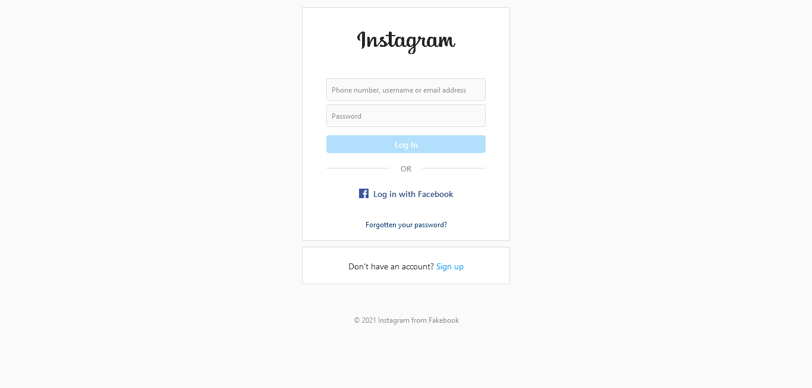

# Instagram clone

> Instagram



A pixel-perfect clone of Instagram web app

## Built With

- React & Redux

## Live Demo

[Live Demo Link](https://frosty-jang-51ab28.netlify.app/)

## Getting Started

To get a local copy up and running follow these simple example steps.

### Prerequisites

- NodeJS - [v16.x](https://nodejs.org/en/)

### Setup

```bash
git clone https://github.com/usmansbk/instagram.git
cd ./instagram
```

### Install

```bash
npm install
```

### Usage

```bash
npm start
```

### Build

```bash
npm run build
```

### Run tests

```bash
npm test
```

## Authors

👤 **Babakolo Usman Suleiman**

- GitHub: [@usmansbk](https://github.com/usmansbk)
- LinkedIn: [LinkedIn](https://www.linkedin.com/in/usman-suleiman-82b444140/)

## 🤝 Contributing

Contributions, issues, and feature requests are welcome!

Feel free to check the [issues page](../../issues/).

## Show your support

Give a ⭐️ if you like this project!

## Acknowledgments

- Facebook
